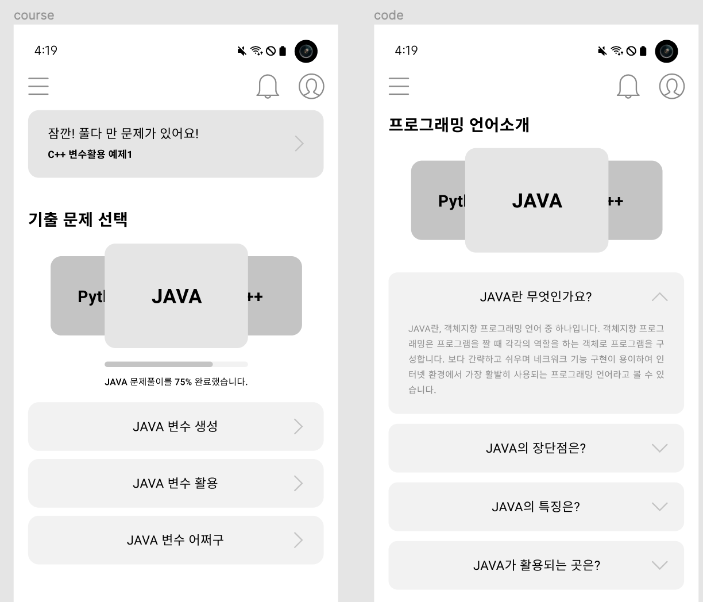
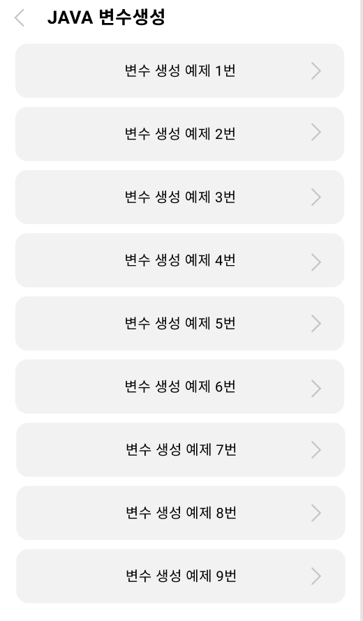

# API List

API_URL : https://radiant-hollows-57561.herokuapp.com

- [API List](#api-list)
  - [문제](#문제)
    - [문제 생성](#문제-생성)
    - [단일 문제](#단일-문제)
    - [이론 리스트](#이론-리스트)
    - [실전 리스트](#실전-리스트)
    - [이론 문제 리스트](#이론-문제-리스트)
    - [실전 문제 리스트](#실전-문제-리스트)
    - [언어별 문제 갯수](#언어별-문제-갯수)
    - [틀린 문제들](#틀린-문제들)
  - [소개 페이지](#소개-페이지)
    - [모든 컨텐츠](#모든-컨텐츠)
    - [book/channel 컨텐츠](#bookchannel-컨텐츠)

## 문제

### 문제 생성

```
POST {{API_URL}}/problem/create
```

| 파라미터        | 파라미터 유형 | 데이터 타입 | 필수 여부 | 설명                    |
| --------------- | ------------- | ----------- | --------- | ----------------------- |
| `language`      | `body`        | `string`    | ✅        | 언어구분 ex)python      |
| `isTheory`      | `body`        | `boolean`   | ✅        | 이론 or 문제            |
| `category`      | `body`        | `string`    | ✅        | 선택창에 표시될 문구    |
| `problemNumber` | `body`        | `string`    | ✅        | 0이면 초기화면에서 표시 |
| `question`      | `body`        | `string`    | ✅        | 질문                    |
| `code`          | `body`        | `string`    | ✅        | 질문 중 코드부분        |
| `option`        | `body`        | `string`    | ✅        | 보기                    |
| `answer`        | `body`        | `string`    | ✅        | 정답                    |

<br/>

### 단일 문제

```
GET {{API_URL}}/problem/getOne/:id
```

| 파라미터 | 파라미터 유형 | 데이터 타입 | 필수 여부 | 설명    |
| -------- | ------------- | ----------- | --------- | ------- |
| `id`     | `path`        | `number`    | ✅        | 문제 id |

<br/>

### 이론 리스트

```
GET {{API_URL}}/problem/theory/{lang}
```



| 파라미터 | 파라미터 유형 | 데이터 타입 | 필수 여부 | 설명               |
| -------- | ------------- | ----------- | --------- | ------------------ |
| `lang`   | `path`        | `string`    | ✅        | 언어구분 ex)python |

<br/>

### 실전 리스트

```
GET {{API_URL}}/problem/question/{lang}
```

| 파라미터 | 파라미터 유형 | 데이터 타입 | 필수 여부 | 설명               |
| -------- | ------------- | ----------- | --------- | ------------------ |
| `lang`   | `path`        | `string`    | ✅        | 언어구분 ex)python |

<br/>

### 이론 문제 리스트

```
GET {{API_URL}}/problem/theory/detail/{lang}
```



| 파라미터   | 파라미터 유형 | 데이터 타입 | 필수 여부 | 설명                 |
| ---------- | ------------- | ----------- | --------- | -------------------- |
| `lang`     | `path`        | `string`    | ✅        | 언어구분 ex)python   |
| `category` | `query`       | `string`    | ✅        | 동일 category를 찾음 |

<br/>

### 실전 문제 리스트

```
GET {{API_URL}}/problem/question/detail/{lang}
```

| 파라미터   | 파라미터 유형 | 데이터 타입 | 필수 여부 | 설명                 |
| ---------- | ------------- | ----------- | --------- | -------------------- |
| `lang`     | `path`        | `string`    | ✅        | 언어구분 ex)python   |
| `category` | `query`       | `string`    | ✅        | 동일 category를 찾음 |

<br/>

### 언어별 문제 갯수

```
GET {{API_URL}}/problem/count/{lang}
```

| 파라미터 | 파라미터 유형 | 데이터 타입 | 필수 여부 | 설명               |
| -------- | ------------- | ----------- | --------- | ------------------ |
| `lang`   | `path`        | `string`    | ✅        | 언어구분 ex)python |

<br/>

### 틀린 문제들

```
GET {{API_URL}}/problem/getWrongs
```

| 파라미터 | 파라미터 유형 | 데이터 타입 | 필수 여부 | 설명                               |
| -------- | ------------- | ----------- | --------- | ---------------------------------- |
| `ids`    | `body`        | `number[]`  | ✅        | id array를 받아 해당 문제들을 리턴 |

## 소개 페이지

### 모든 컨텐츠

```
GET {{API_URL}}/page/all
```

| 파라미터 | 파라미터 유형 | 데이터 타입 | 필수 여부 | 설명 |
| -------- | ------------- | ----------- | --------- | ---- |

<br/>

### book/channel 컨텐츠

```
GET {{API_URL}}/page/contents
```

| 파라미터 | 파라미터 유형 | 데이터 타입 | 필수 여부 | 설명                                     |
| -------- | ------------- | ----------- | --------- | ---------------------------------------- |
| `isBook` | `query`       | `boolean`   | ✅        | isBook이 true라면 도서내용을 가져옵니다. |
